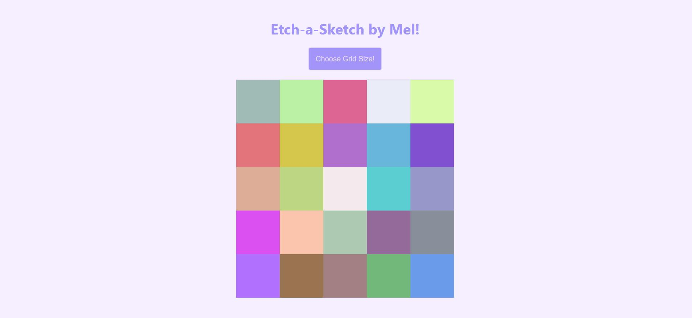
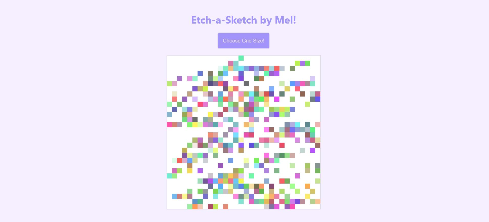

# Etch-a-Sketch

Created a sketchpad which lets the user to create a grid and change the color of the cells inside the grid as they hover over the cells. 

There is a button which lets the user to choose a grid size of their choosing, a maximum of 100x100.

Each time button is clicked, previous cells are reset.

An example of respectively 5x5 and 40x40 Etch-a-Sketch grid.

